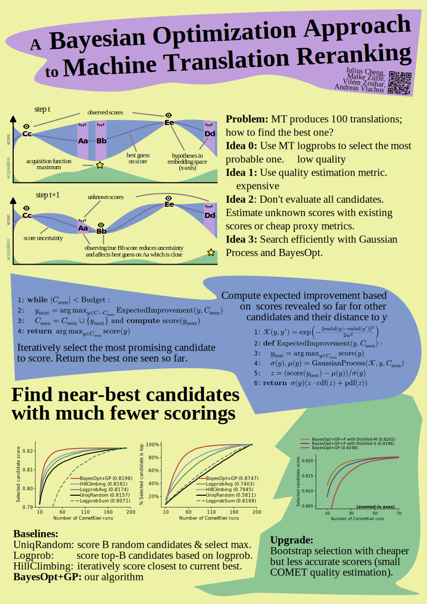

# A Bayesian Optimization Approach to Machine Translation Reranking [](https://arxiv.org/abs/2411.09694)

By Julius Cheng, Maike Züfle, Vilém Zouhar, and Andreas Vlachos.

> Reranking a list of candidates from a machine translation system with an external scoring model and returning the highest-scoring candidate remains a simple and effective method for improving the overall output quality. Translation scoring models continue to grow in size, with the best models being comparable to generation models. Thus, reranking can add substantial computational cost to the translation pipeline. In this work, we pose reranking as a Bayesian optimization (BayesOpt) problem. By strategically selecting candidates to score based on a balance of exploration and exploitation, we show that it is possible to find top-scoring candidates when scoring only a fraction of the candidate list. For instance, our method achieves the same CometKiwi score using only 70 scoring evaluations compared a baseline system using 180. We present a multi-fidelity setting for BayesOpt, where the candidates are first scored with a cheaper but noisier proxy scoring model, which further improves the cost-performance tradeoff when using smaller but well-trained distilled proxy scorers.


## Experiments
To replicate our experiments, please refer to the scripts in  [efficient_reranking/](efficient_reranking).

### Download data 
The data can be obtained by using scripts from the  [experiments_small_comet/scripts/](experiments_small_comet/scripts/) directory:
```
cd experiments_small_comet/scripts
bash 01a-get_data.sh  # download data
python 01b-get_da_data.py # prepare data
```
The data will be downloaded to `experiments_small_comet/scripts/data/`. 
### Generate candidates

```
cd ../../experiments_reranking
python scripts/generate_candidates.py <data_dir> test <output_dir> --generation_mode sample --max_batch_size 50
```
Replace the data and output directory to your needs. Candidates can also be obtained using beam search, to do so, use `beam` as a generation mode instead of `sample`. 

Candidates can then be scored using the following script: 

```
python scripts/score_comet_layerwise.py <data_dir> test <output_dir> --comet_repo=Unbabel/wmt22-cometkiwi-da
```

### Run bandit algorithm
Finally, the GP bandit can be run with the following steps: 
```
python scripts/get_logprobs.py <data_dir> <output_dir> # retrieve the log probs

python scripts/get_similarities.py <data_dir> <output_dir> # calculate similarities between candidates

python scripts/run_simple_gp_bandit.py <data_dir> <output_dir> wmt22-cometkiwi-da all test 0.25 50  # run bandit
```


### Training smaller COMET models

The publicly available COMET models are trained with XLM-Roberta, which might be too expensive to run in re-ranking setting.
See `experiments/small_comet` for scripts to train a COMET model with smaller base LLMs.

## Cite as 
```
@misc{cheng2024bayesianoptimizationapproachmachine,
      title={A Bayesian Optimization Approach to Machine Translation Reranking}, 
      author={Julius Cheng and Maike Züfle and Vilém Zouhar and Andreas Vlachos},
      year={2024},
      eprint={2411.09694},
      archivePrefix={arXiv},
      primaryClass={cs.CL},
      url={https://arxiv.org/abs/2411.09694}, 
}
```

